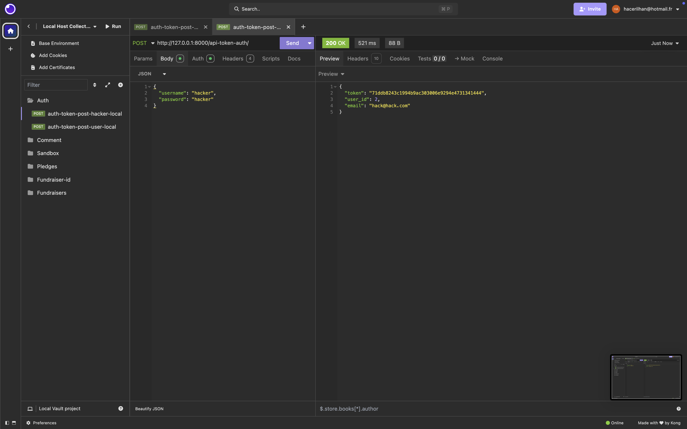
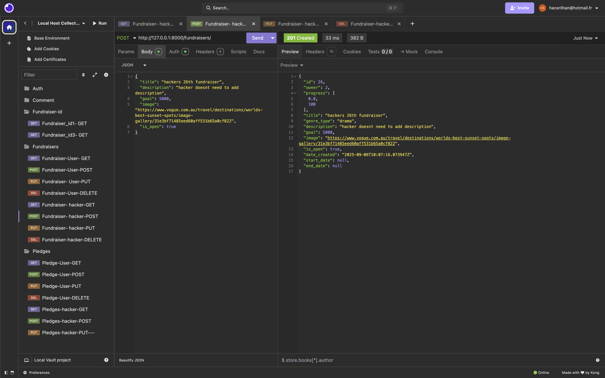
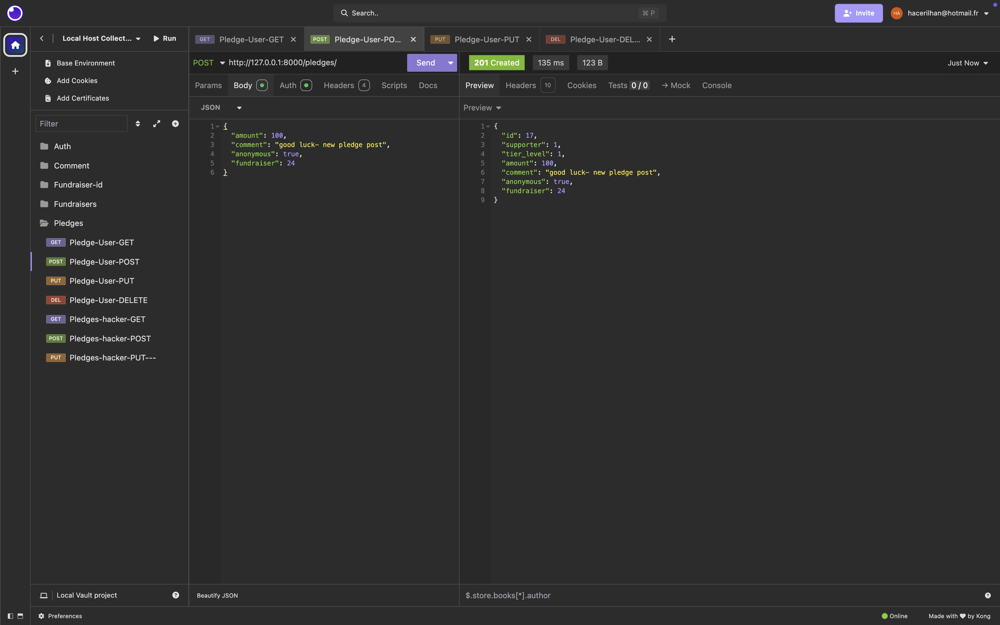
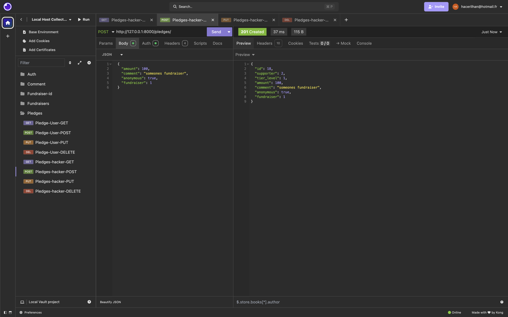
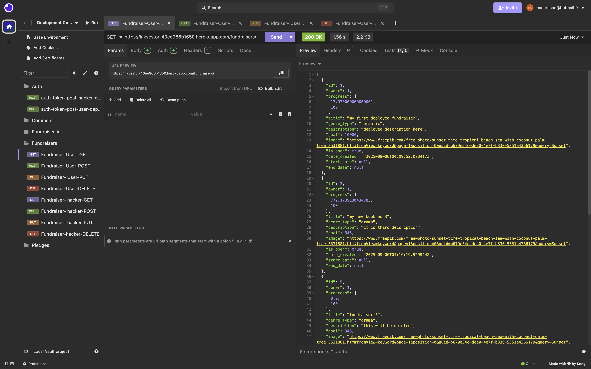
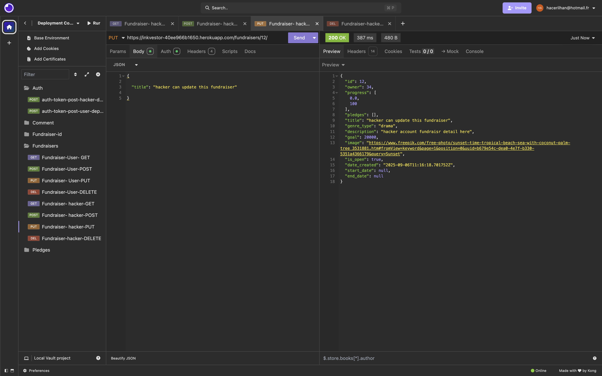
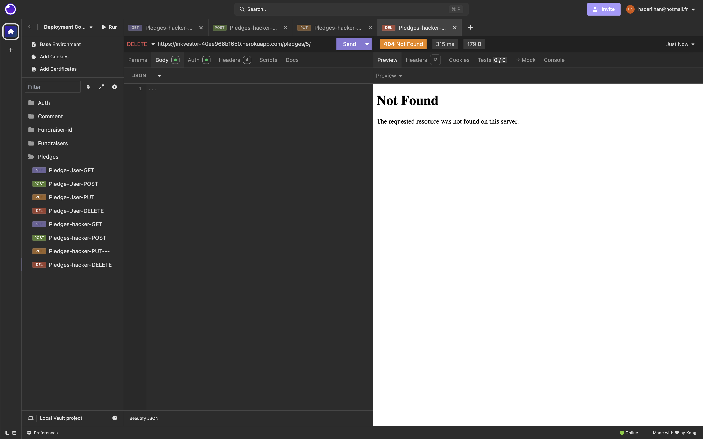

# Crowdfunding Back End

Arsen ILHAN

### Concept/Name

Inkvestor empowers aspiring authors to bring their stories to life.
Readers and supporters can contribute to the books they want to see published, helping writers cover editing, design, and printing costs. If a project reaches its funding goal, the book gets published — turning creative dreams into real pages.

### Intended Audience/User Stories

Our intended audience includes aspiring authors, book lovers, and supporters of creative projects.
Authors will use the website to showcase their book ideas, set funding goals, and connect with potential readers who believe in their work.
Supporters and readers will browse projects, choose the books they want to see published, and contribute funds to help bring those books to life.

### Front End Pages/Functionality

#### Home Page
- Featured fundraising projects (highlighting popular or new campaigns)
- Search and filter options for projects (by genre, funding goal, author, etc.)
- Quick “Support Now” buttons for easy backing
- Links to create a new fundraiser or browse categories

#### Create New Fundraiser Page
- Form with fundraiser details (title, description, funding goal, cover image, sample content)
- Option to set campaign duration and reward tiers
- Ability to preview before submitting
- Submit button to publish the fundraiser
- Nice error pages and inline validation for missing or incorrect details

#### Project Detail Page
- Full description of the book project
- Author profile and background
- Funding progress bar and number of backers
- “Support This Project” section with pledge options
- Comment and Q&A section for backer interaction

#### User Dashboard
- List of fundraisers created by the user
- Funding status and analytics for each project
- Edit or update campaigns (e.g., post news or progress updates)

#### Error / Info Pages
- Custom 404 “Page Not Found” page
- Custom error pages for form validation issues
- Friendly “Thank You” page after a successful pledge or campaign creation


### API Spec

{{ Fill out the table below to define your endpoints. An example of what this might look like is shown at the bottom of the page.

It might look messy here in the PDF, but once it's rendered it looks very neat!

It can be helpful to keep the markdown preview open in VS Code so that you can see what you're typing more easily. }}

different endpoints ( like /fundraisers page pledges, profile etc )


| URL                       | HTTP Method | Purpose                                           | Request Body                | Success Response Code | Authentication/Authorisation        |
| ------------------------- | ----------- | ------------------------------------------------- | --------------------------- | --------------------- | ------------------------------------ |
| /fundraisers              | GET         | Fetch all fundraisers                             | N/A                         | 200                   | None                                 |
| /fundraisers              | POST        | Create a new fundraiser                           | JSON Payload                | 201                   | Any logged-in user                   |
| /fundraisers/{id}         | GET         | Fetch details of a specific fundraiser            | N/A                         | 200                   | None                                 |
| /fundraisers/{id}         | PUT         | Update an existing fundraiser                     | JSON Payload                | 200                   | Fundraiser owner only                |
| /fundraisers/{id}         | DELETE      | Delete a fundraiser                               | N/A                         | 204                   | Fundraiser owner only                |
| /fundraisers/{id}/pledges | GET         | Fetch all pledges for a specific fundraiser       | N/A                         | 200                   | Fundraiser owner or admin            |
| /fundraisers/{id}/pledges | POST        | Create a pledge for a fundraiser                  | JSON {Payload} {"fundraiser_id"}  | 201             | Any logged-in user                   |
| /fundraisers/{id}/pledges | DELETE      | Delete pledge                                     | NA                          | 204                   | Fundraiser owner or admin            |
| /fundraisers/{id}/pledges | PUT         | Update pledge                                     | JSON Paylod                 | 200                   | Fundraiser owner            |
| /profile                  | GET         | Fetch logged-in user profile details              | N/A                         | 200                   | Logged-in user                       |
| /profile                  | PUT         | Update logged-in user profile                     | JSON Payload                | 200                   | Logged-in user                       |
| /auth/register            | POST        | Register a new user                               | JSON Payload                | 201                   | None                                 |
| /auth/login               | POST        | Log in and retrieve authentication token          | JSON Payload                | 200                   | None                                 |
| /auth/logout              | POST        | Log out user and invalidate session/token         | N/A                         | 204                   | Logged-in user                       |


### DB Schema


### Testing Markdown all in one 
``` python
print ("Hello World")

```

``` New line
"My new line testing here" 
You need to start with three ``` and finish with three ```
```

# LOCALHOST SCREENSHOT

Lets have a look at the accounts first. 



## Fundraiser
Get for user:We see fundraiser ide 1,2,6...

The last Fundraiser id is 24. I will delete 23th one later, pay attention to this. 

Post for user: as you see above, last one was 24. you see 25th fundraiser here.

Put for user:lets update this 25th fundriaser details

this fundraiser is not my own fundraiser, so. icannot update it

Delete for user:

lets try to delete fundraiser 24

It didnt allow us to delete because it is created by other user.
Lets check the get request again now.

As you see above, 23th is deleted and 24th stayed and the last one shows my updated details too.
lets jump to the hacker account.
Get for hacker: we see all the fundraisers 

we see the last fundraiser 24th and 25th

Post for hacker:

Put for hacker: i can do it, because it is hackers fundraiser

this fundraiser is not my own fundraiser, so. icannot update it

Delete for hacker:i could delete 26th as hacker created it

this is created by other user, i cannot delete it.

I won't see the 26th as i deleted it.
Lets see individual fudnraiser id:


## Pledges
Get for user:We see pledges from  1,2,3..

The last pledge is id is  16

All these were created before pledging against your own fundraiser rule. 

as the above is my own pledge, i couldnt raise pledge

i pledged for other users fundraiser

i tried to pledge agaisnt fundraiser doesnt exist.
I can update comment and amount. this will be fixed in later stages. 

Once you pledge/ donate, you cannot take it back. thats why this is not working


The last pledge is id is  16

All these were created before pledging against your own fundraiser rule. 

as the above is my own pledge, i couldnt raise pledge

i pledged for other users fundraiser

i tried to pledge agaisnt fundraiser doesnt exist.
I can update comment and amount. this will be fixed in later stages. 

Once you pledge/ donate, you cannot take it back. thats why this is not working


## Comment

Any user can comment on fundraiser.


# DEPLOYMENT SCREENSHOT
Lets have a look at the accounts first. 


## Fundraiser
Get for user:We see fundraiser ide 1,3,5...

The last Fundraiser id is 7. I will delete this one later.

Post for user: as you see above 9th one is newly added

Put for user:lets update this 9th fundriaser details

this fundraiser is not my own fundraiser, so. icannot update it

Delete for user:

lets try to delete fundraiser 24

It didnt allow us to delete because it is created by other user.
Lets check the get request again now.

lets jump to the hacker account.
Get for hacker: we see all the fundraisers 


Post for hacker:

Put for hacker: i can do it, because it is hackers fundraiser

this fundraiser is not my own fundraiser, so. icannot update it

Delete for hacker:i could delete 26th as hacker created it

this is created by other user, i cannot delete it.

Lets see individual fudnraiser id:


## Pledges
Get for user:We see pledges here


All these were created before pledging against your own fundraiser rule. 

as the above is my own pledge, i couldnt raise pledge

i pledged for other users fundraiser


i tried to pledge agaisnt fundraiser doesnt exist.
I can update comment and amount. this will be fixed in later stages. 


Once you pledge/ donate, you cannot take it back. thats why this is not working


The last pledge is id is  16


All these were created before pledging against your own fundraiser rule. 


as the above is my own pledge, i couldnt raise pledge


i pledged for other users fundraiser


i tried to pledge agaisnt fundraiser doesnt exist.
I can update comment and amount. this will be fixed in later stages. 


Once you pledge/ donate, you cannot take it back. thats why this is not working


## Comment


Any user can comment on fundraiser.


